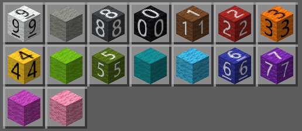
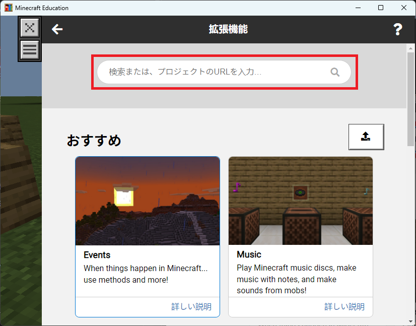
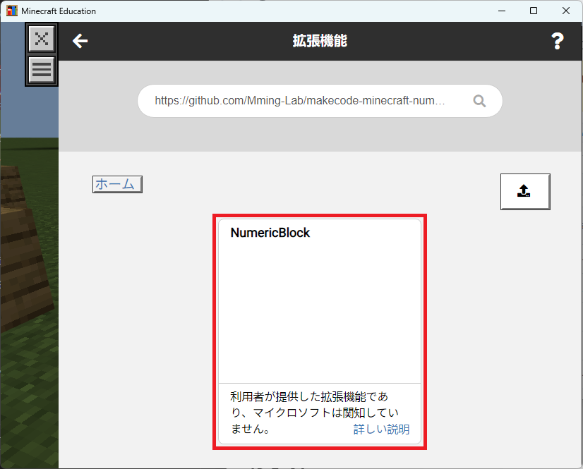
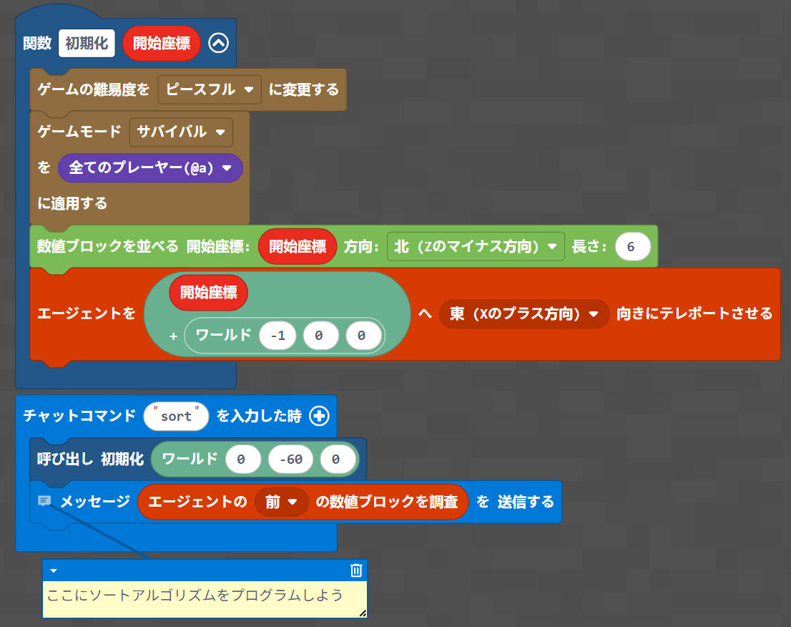

# 数値ブロック (Numeric Block)

エージェントが数値ブロック（色付き羊毛）を読み取ってソートアルゴリズムを実行できるMakeCode拡張機能です。

> Open this page at [https://mming-lab.github.io/numericblock/](https://mming-lab.github.io/numericblock/)

## こんなことができます



- エージェントが色から数値（0-9）を読み取る
- ランダムな数値ブロックを配置する
- ソートアルゴリズムを実装する

## インストール方法

### 1. 拡張機能ボタンを押下

MakeCode for Minecraftのエディタ画面で、左下の**拡張機能**ボタンをクリックします。


### 2. リポジトリURLを入力して検索

検索欄に以下のURLを入力して検索します：

```
https://github.com/mming-lab/numericblock
```



### 3. 拡張機能を取り込み

検索結果に表示された拡張機能を選択してインポートします。



## 使い方

### 数値ブロック検査

エージェントが指定した方向のブロックを検査して、色から数値（0-9）を読み取ります。


```
エージェントの〇〇の数値ブロックを調査
```

## ソートアルゴリズムの実装


スターターテンプレート：📥 [minecraft-NumericBlock.mk](./minecraft-NumericBlock.mk)



このテンプレートで、以下の2つの機能を組み合わせてソートアルゴリズムを実装します：

1. **数値ブロック配置**で、ランダムな数値ブロックを一列に配置
2. **数値ブロック検査**で、色から数値を読み取ってソート

```typescript
function 初期化 (開始座標: Position) {
    blocks.numline(開始座標, NORTH_CARDINAL_DIRECTION, 6)
    agent.teleport(positions.add(
    開始座標,
    world(-1, 0, 0)
    ), EAST)
}
player.onChat("sort", function () {
    初期化(world(0, -60, 0))
    // ソートアルゴリズムを記述
    player.say(agent.inspectNumericBlock(FORWARD))
})
```

## ライセンス

MIT License - 詳細は [LICENSE](LICENSE) ファイルを参照してください。

#### Metadata (used for search, rendering)

* for PXT/minecraft
<script src="https://makecode.com/gh-pages-embed.js"></script><script>makeCodeRender("{{ site.makecode.home_url }}", "{{ site.github.owner_name }}/{{ site.github.repository_name }}");</script>
