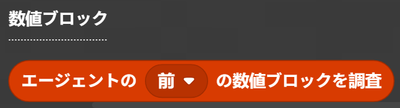
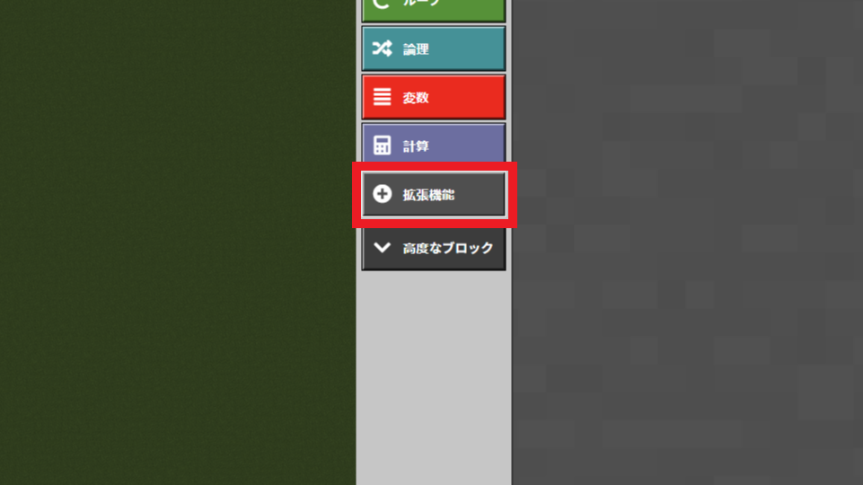

# 数値ブロック検査

エージェントが数値ブロックを検査すると数値を読み取る MakeCode 拡張機能です。

## 実装例

[](https://mming-lab.github.io/makecode-minecraft-numeric-blocks/)

### バブルソート

隣同士の要素を比較して、大小関係が逆なら交換を繰り返すアルゴリズムです。

<video width="640" height="360" controls>
  <source src="./images/バブルソート.mp4" type="video/mp4">
  お使いのブラウザは動画タグに対応していません。
</video>

## 使い方

### 数値ブロック検査

エージェントが指定した方向のブロックを検査して、色から数値（0-9）を読み取ります。




### 数値ブロック

数値ブロック（色付き羊毛）は、[minecraft-numeric-blocks-mcaddo アドオン](https://github.com/Mming-Lab/minecraft-numeric-blocks-mcaddo)で提供されています。


抵抗器のカラーコードに基づいた色分けで、数字 0-9 を表現します：

- **0 ＝黒色** / **1 ＝茶色** / **2 ＝赤色** / **3 ＝橙色** / **4 ＝黄色**
- **5 ＝緑色** / **6 ＝青色** / **7 ＝紫色** / **8 ＝灰色** / **9 ＝白色**

## スターターテンプレート

ソートアルゴリズムを実装するためのスターターテンプレート：

📥 [minecraft-NumericBlock.mkcd](./minecraft-NumericBlock.mkcd)


```typescript
function 初期化 (開始座標: Position) {
    // 破壊したブロックを1個だけ保持したいのでサバイバルモード
    gameplay.setDifficulty(PEACEFUL)
    gameplay.setGameMode(SURVIVAL, mobs.target(ALL_PLAYERS))
    // 数値ブロックを並べる
    blocks.numline(開始座標, NORTH_CARDINAL_DIRECTION, 6)
    // エージェントを開始位置にテレポート
    agent.teleport(positions.add(開始座標,world(-1, 0, 0)), EAST)
}
player.onChat("sort", function () {
    初期化(world(0, -60, 0))
    // ここにソートアルゴリズムをプログラムしよう
    player.say(agent.inspectNumericBlock(FORWARD))
})
```

**`blocks.numline` ブロック:**


- 指定した座標から、指定した方向に、ランダムにシャッフルされた数値ブロックを配置します
- 配置できるブロック数は 2～10 個です

## インストール方法

### 1. 数値ブロックアドオンのインストール

まず、[minecraft-numeric-blocks-mcaddo アドオン](https://github.com/Mming-Lab/minecraft-numeric-blocks-mcaddo)をインストールしてください。

### 2. MakeCode 拡張機能の追加

#### 2-1. 拡張機能ボタンを押下

MakeCode for Minecraft のエディタ画面で、左下の**拡張機能**ボタンをクリックします。



#### 2-2. リポジトリ URL を入力して検索

検索欄に以下の URL を入力して検索します：

```
https://github.com/mming-lab/makecode-minecraft-numeric-blocks
```


#### 2-3. 拡張機能を取り込み

検索結果に表示された拡張機能を選択してインポートします。


